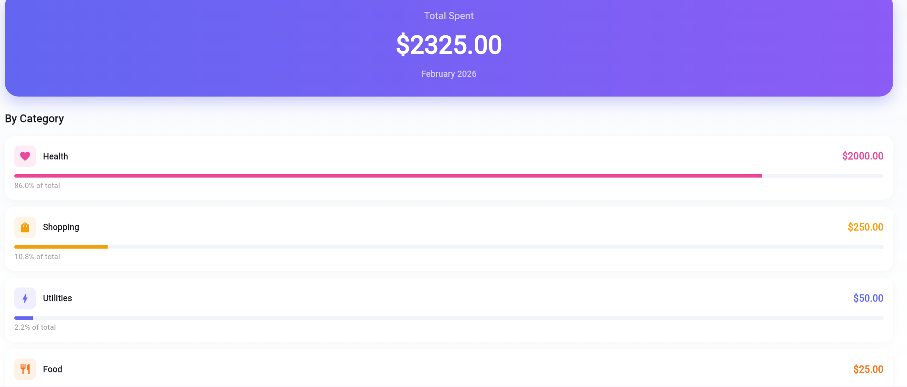

# SmartSpend

AI-Powered Expense Tracking Application


---

## Overview

SmartSpend is a full-stack expense tracking application with AI-powered automatic categorization using machine learning.

### Key Features
- AI Auto-Categorization - ML model predicts expense categories from descriptions
- Monthly Summaries - Beautiful charts showing spending by category
- Cross-Platform - Works on Web, iOS, Android, and Desktop
- Secure Authentication - JWT-based user system
- Modern UI - Beautiful Material Design 3 interface

---

## Architecture

```
┌─────────────────────────────────────────────────────────────┐
│                        FRONTEND                              │
│                    (Flutter Web/Mobile)                      │
│                                                              │
│  ┌──────────┐  ┌──────────┐  ┌──────────┐                  │
│  │   Add    │  │ Summary  │  │ Expenses │                  │
│  │ Expense  │  │   Tab    │  │   List   │                  │
│  ────┬─────┘  ────┬─────┘  ────┬─────┘                  │
│       │             │             │                          │
│       ─────────────┴─────────────┘                          │
│                     │                                        │
│              HTTP API Calls                                   │
─────────────────────┬───────────────────────────────────────┘
                      │
                      ▼
┌─────────────────────────────────────────────────────────────┐
│                        BACKEND                               │
│                     (FastAPI + Python)                       │
│                                                              │
│  ┌──────────────────────────────────────────────────────┐  │
│  │                    API Endpoints                      │  │
│  │  /auth/login  /expenses/  /ml/predict  /summary      │  │
│  ──────────────────────┬───────────────────────────────┘  │
│                         │                                   │
│  ┌─────────────┐  ┌─────┴──────┐  ┌───────────────┐       │
│  │  Database   │  │   ML      │  │  Auth/JWT     │       │
│  │  SQLite    │  │  Model    │  │  Security    │       │
│  ─────────────┘  ───────────┘  ───────────────┘       │
─────────────────────────────────────────────────────────────┘
```

---

## Quick Start

### 1. Start the Backend

```bash
# Navigate to backend
cd backend

# Install dependencies
pip install -r requirements.txt

# Train ML model (optional, already trained)
python -m app.utils.train_model

# Start server
python -m uvicorn app.main:app --reload
```

Backend runs at: `http://127.0.0.1:8000`

### 2. Start the Frontend

```bash
# Navigate to frontend
cd smartspend_frontend

# Install dependencies
flutter pub get

# Run on web (recommended)
flutter run -d chrome
```

---

## Screenshots

### Login Screen
Modern gradient background with glassmorphism card for authentication.


### Add Expense Screen
Large amount input with AI categorization button. Shows predicted category after adding.


### Monthly Summary Screen
Beautiful gradient total card with category breakdown and progress bars.


### Expense List Screen
Swipeable expense cards with tap-to-edit category functionality.


### Edit Category Dialog
Tap on any expense to change its category if AI predicted incorrectly.


---

##  Project Structure

```
SmartSpend/
│
├── backend/                    # Python FastAPI Backend
│   ├── app/
│   │   ├── main.py           # FastAPI app entry
│   │   ├── models.py         # SQLAlchemy database models
│   │   ├── schemas.py        # Pydantic schemas
│   │   ├── database.py       # Database configuration
│   │   ├── routes/          # API endpoints
│   │   │   ├── auth.py      # Login/Signup
│   │   │   ├── expenses.py   # Expense CRUD
│   │   │   ├── categories.py
│   │   │   ── predict.py   # ML prediction
│   │   ── utils/           # Utilities
│   │       ├── nlp.py       # ML preprocessing
│   │       ├── train_model.py
│   │       ── security.py
│   ├── expenses_dataset.csv  # ML training data
│   ├── expense_model.pkl     # Trained model
│   ├── requirements.txt
│   ── smartspend.db        # SQLite database
│
├── smartspend_frontend/      # Flutter Frontend
│   ├── lib/
│   │   ── main.dart        # Main Flutter app
│   ├── pubspec.yaml
│   ├── build/               # Compiled web app
│   ── README.md
│
├── .gitignore
── README.md               # This file
```

---

##  API Endpoints

### Authentication
| Endpoint | Method | Description |
|----------|--------|-------------|
| `/auth/signup` | POST | Create new user account |
| `/auth/login` | POST | Login, returns JWT token |

### Expenses
| Endpoint | Method | Description |
|----------|--------|-------------|
| `/expenses/` | GET | Get all user expenses |
| `/expenses/` | POST | Create new expense |
| `/expenses/{id}` | GET | Get single expense |
| `/expenses/{id}` | PUT | Update expense |
| `/expenses/{id}` | DELETE | Delete expense |
| `/expenses/summary/{year}/{month}` | GET | Monthly spending summary |

### Machine Learning
| Endpoint | Method | Description |
|----------|--------|-------------|
| `/ml/predict` | POST | Predict category from description |

---

##  Machine Learning

### Model Training
- **Algorithm**: SVM (Support Vector Machine) with Linear Kernel
- **Features**: TF-IDF Vectorization with n-grams (1-2)
- **Accuracy**: 75.8%
- **Classes**: 9 expense categories

### Training Data
Located in `backend/expenses_dataset.csv`:
```csv
description,category
coffee at starbucks,Food
uber ride,Transportation
netflix subscription,Entertainment
```

### Re-training the Model
```bash
cd backend
python -m app.utils.train_model
```

---

##  Tech Stack

### Backend
- **FastAPI** - Modern Python web framework
- **SQLAlchemy** - SQL toolkit and ORM
- **Python-JOSE** - JWT token handling
- **Passlib** - Password hashing
- **scikit-learn** - Machine learning
- **NLTK** - Natural language processing

### Frontend
- **Flutter** - Cross-platform UI framework
- **Material Design 3** - Design system
- **http** - HTTP client package

### Database
- **SQLite** - Embedded relational database

---

##  Configuration

### Change Backend Port
In `backend/app/main.py`, modify the uvicorn command:
```bash
python -m uvicorn app.main:app --reload --port 8001
```

### Change API URL
In `smartspend_frontend/lib/main.dart`:
```dart
static const String _baseUrl = 'http://localhost:8000';
```

### Change Database Location
In `backend/app/database.py`:
```python
DATABASE_URL = "sqlite:///./your_path.db"
```

---

##  Installation

### Backend Dependencies
```bash
cd backend
pip install -r requirements.txt
```

### Frontend Dependencies
```bash
cd smartspend_frontend
flutter pub get
```

---

##  Running the Application

### Development Mode

**Terminal 1 - Backend:**
```bash
cd backend
python -m uvicorn app.main:app --reload
```

**Terminal 2 - Frontend:**
```bash
cd smartspend_frontend
flutter run -d chrome
```

### Production Build

**Backend:**
```bash
cd backend
python -m uvicorn app.main:app --host 0.0.0.0 --port 8000
```

**Frontend:**
```bash
cd smartspend_frontend
flutter build web
# Output in build/web/
```

---

##  Troubleshooting

### CORS Errors
If frontend can't connect to backend, ensure CORS is enabled in `backend/app/main.py`:
```python
app.add_middleware(
    CORSMiddleware,
    allow_origins=["*"],
    allow_credentials=True,
    allow_methods=["*"],
    allow_headers=["*"],
)
```

### ML Model Not Found
Train the model first:
```bash
cd backend
python -m app.utils.train_model
```

### Database Errors
Delete the database file and restart:
```bash
rm backend/smartspend.db
python -m uvicorn app.main:app --reload
```

---

##  Performance

| Component | Metric |
|-----------|--------|
| ML Model Accuracy | 75.8% |
| API Response Time | <100ms |
| Frontend Bundle Size | ~2MB |
| Cold Start Time | <2s |

---

##  Contributing

1. Fork the repository
2. Create your feature branch (`git checkout -b feature/amazing`)
3. Commit your changes (`git commit -m 'Add amazing feature'`)
4. Push to the branch (`git push origin feature/amazing`)
5. Open a Pull Request

---

##  License

MIT License - See LICENSE file for details.

---

**Built with  using FastAPI + Flutter**
